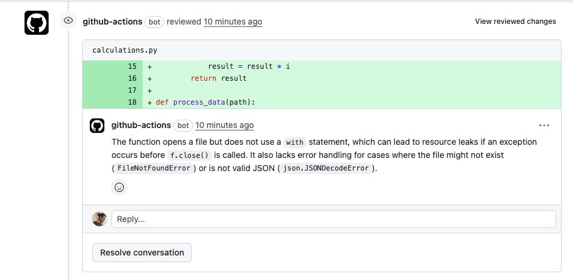

# Automated PR Code Reviewer with Gemini

An automated code reviewer that uses Google's Gemini Pro to review pull requests and add comments directly to the changed files. This project is built as a custom GitHub Action using TypeScript.

---

## Core Features

- **Automated Trigger**: The review process runs automatically whenever a pull request is opened or updated.
- **LLM-Powered Reviews**: Leverages the Gemini Pro model to analyze code diffs for potential issues in security, maintainability, readability, and more.
- **Inline Comments**: Posts review suggestions as comments directly on the relevant lines in the pull request, just like a human reviewer would (see [this example PR](https://github.com/karthick-manoharan/automated-code-reviewer-for-github/pull/1)).
- **Customizable Instructions**: The behavior and focus of the reviewer can be easily modified by editing a single prompt file (`review-prompt.md`) without changing any code.

## How It Works

The process is orchestrated entirely within GitHub Actions:

1.  A developer creates or updates a **Pull Request**.
2.  The **GitHub Action** workflow defined in `.github/workflows/code-review.yml` is triggered.
3.  The workflow executes a custom action defined in `.github/actions/reviewer`.
4.  The TypeScript script (`main.ts`) runs, fetching the code changes (the "diff") from the PR.
5.  The script reads the instructions from `review-prompt.md`, combines them with the diff, and sends them to the **Gemini API**.
6.  The script parses the JSON response from Gemini and posts the suggestions as **review comments** on the PR using the GitHub API.

## Setup Guide

To get this working in your own forked or cloned repository, follow these steps:

#### 1. Get a Gemini API Key

- Go to [Google AI Studio](https://aistudio.google.com/app/apikey).
- Create a new API key.

#### 2. Set the GitHub Secret

- In your GitHub repository, go to **Settings** > **Secrets and variables** > **Actions**.
- Click **New repository secret**.
- Name the secret **exactly** `GEMINI_API_KEY`.
- Paste the key you got from Google AI Studio into the value field.

#### 3. Ensure Workflows Have Write Permissions

The action needs permission to post comments on your behalf.

- In your repository, go to **Settings** > **Actions** > **General**.
- Scroll down to the "Workflow permissions" section.
- Ensure the **"Read and write permissions"** option is selected. (Note: The `permissions` block in the `code-review.yml` file also requests this, but setting it here ensures it works without issue).

#### 4. Test It!

- Create a new branch.
- Make some code changes and push them to the branch.
- Open a new Pull Request.

The "Code Reviewer" action will start automatically. You can monitor its progress on the PR page or in the "Actions" tab.

## Customization

The real power of this tool lies in its customizable prompt. You can guide the LLM to focus on specific aspects of the review by editing the **`review-prompt.md`** file.

For example, you could ask it to:
- Focus only on security vulnerabilities.
- Enforce a specific coding style.
- Check for documentation quality.
- Provide suggestions in a different language.

The prompt requires the LLM to return a specific JSON format, so be sure to maintain that part of the instruction.

## Limitations & Future Improvements

This is a hobby project and has several areas that could be improved:

- **Cost**: API calls to Google Gemini are not free. Monitor your usage and set up billing alerts in your Google Cloud project.
- **Large Pull Requests**: The entire diff is currently sent in a single API call. Very large PRs might exceed the model's context window limit or become expensive to review.
  - **Improvement**: The script could be updated to split large diffs by file and make separate API calls for each, posting comments incrementally.
- **Lack of Full Codebase Context**: The reviewer only sees the lines that were changed (the diff), not the entire file or project. This can lead to suggestions that don't make sense in the broader context.
  - **Improvement**: A more advanced implementation could fetch the full content of changed files or use vector embeddings of the codebase to provide more context to the LLM.
- **Basic Error Handling**: The current error handling is minimal. If the LLM returns malformed JSON or the action fails midway, it might not provide clear feedback on the PR.
  - **Improvement**: Add more robust error handling, including retries and posting a summary comment to the PR if the action fails.
- **Prompt Engineering**: The quality of the review is highly dependent on the quality of the prompt.
  - **Improvement**: Continuously refine `review-prompt.md` with more sophisticated instructions, examples, and role-playing to get better results from the LLM.